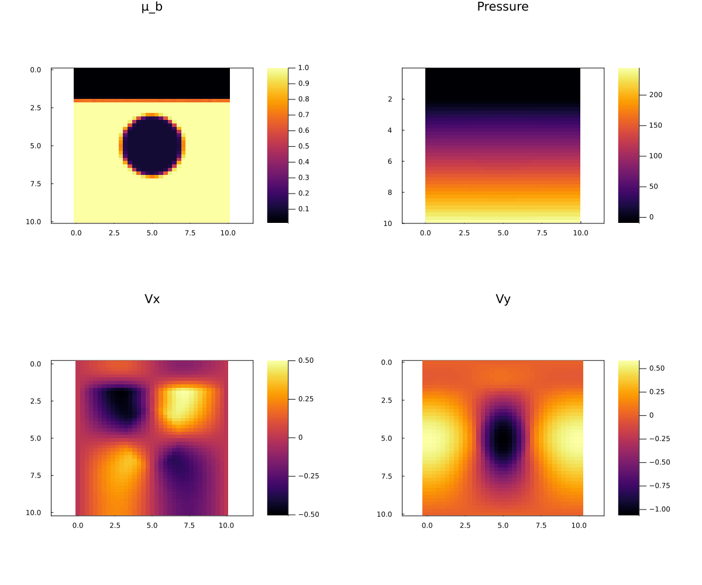

# StokesFlow.jl

[](https://github.com/dastrm/StokesFlow.jl/actions/workflows/CI.yml)

Multi-xPU solver for the 2D Stokes & continuity equations, with variable density and viscosity, written in Julia. Material Properties are advected using Marker-in-Cell techniques.

## Introduction

The motion of viscous fluids can be modelled by solving the Navier–Stokes equations numerically. With a focus on the 2D Stokes equations with continuity assumption, a common simplification in computational fluid dynamics is explored in this project. For example, processes in the earth's mantle are commonly studied using similar assumptions, usually with more sophisticated coupling (e.g temperature) which is not implemented here. Additionally, we demonstrate the use of packages in Julia which allow reasonable scaling from one CPU core to potentially thousands of GPU nodes with ease.

To avoid an unreasonably dense grid and still ensure no (purely numerical) diffusion of material properties, the marker-in-cell technique was chosen over implicit advection on the grid.

Also, every major function is tested by an extensive test suite.

## Content

- [StokesFlow.jl](#stokesflowjl)
  - [Introduction](#introduction)
  - [Content](#content)
  - [Script list](#script-list)
  - [Usage](#usage)
  - [2D Stokes and continuity](#2d-stokes-and-continuity)
  - [Implementation](#implementation)
  - [Results](#results)
  - [Discussion](#discussion)
  - [TODO](#todo)

## Script list
TODO update
TODO link these files where mentioned

The [scripts](/scripts/) folder contains the following Julia scripts:
- [`StokesFlow2D_multigpu.jl`](scripts/StokesFlow2D_multigpu.jl), main script
- [`StokesSolver_multixpu.jl`](scripts/StokesSolver_multixpu.jl), standalone multi-xPU Stokes solver
- [`viz.jl`](scripts/viz.jl), visualization script

## Usage

We provide a [`Project.toml`](Project.toml) file which installs all requirements upon activation. Once all packages are installed, the main script can be launched from the command line as follows:

```sh
mpiexecjl -n 2 julia --project=. scripts/multi_process/StokesFlow2D_multixpu.jl
```

Note that the `-n` flag controls the amount of MPI processes to be spawned, which in our exemplary case is set to two. During execution, relevant output is written to a newly created folder `viz_out`. In order to visualize the output upon completion, the visualization script can be run as follows:

```sh
julia --project=. scripts/viz.jl
```

The resulting figures can be found in the folder `viz_out`.

Additionally, the script allows for live visualization during computation if desired.

## 2D Stokes and Continuity
### Equations and Boundary Conditions

The **2D Stokes and continuity** equations, assuming earth's gravity in positive $y$-direction, are:
$$
\frac{\partial \tau_{xx}}{\partial x} + \frac{\partial \tau_{xy}}{\partial y} - \frac{\partial P}{\partial x} = 0
$$
$$
\frac{\partial \tau_{yx}}{\partial x} + \frac{\partial \tau_{yy}}{\partial y} - \frac{\partial P}{\partial y} = -\rho g y
\newline
\nabla \cdot V = 0,
$$
with
$$
\tau_{xx} = 2 \mu \frac{\partial V_x}{\partial x} 
$$
$$
\tau_{yy} = 2 \mu \frac{\partial V_y}{\partial y} 
$$
$$
\tau_{xy} = \mu \left(\frac{\partial V_x}{\partial y} + \frac{\partial V_y}{\partial x}  \right).
$$

The material properties (carried by markers) are
* $\mu$ : viscosity
* $\rho$ : density,

the other variables describe
* $V = [V_x, V_y]^T$ : velocity
* $P$ : pressure
* $g$ : earth gravity
* $\tau$ : deviatoric stress tensor.

The **Boundary conditions** implemented here are **free slip** on all four boundaries, i.e.
$$
\nabla V \cdot n = 0 \ \ \ \ \mathrm{on} \ \partial\Omega.
$$

The **Initial Conditions**, i.e. the initial density and viscosity distributions, must also be specified. The function `exampleCall()` in the [`StokesSolver_multixpu.jl`](scripts/multi_process/StokesSolver_multixpu.jl) script, implementes a toy model of a plume rising in the earth's mantle. However, the low density and viscosity of the top 'air' causes some instability ('drunken sailor instability'), which is explained in the section [Details of Stokes Solver](#details-of-stokes-solver).

## Implementation

### General structure

After initialization, the computation loop's content is rather simple:

1. **Interpolate** marker properties (density and viscosity) to the computational grid
2. **Solve the Stokes & Continuity equations** on the grid using the interpolated material properties
3. Use the resulting velocity field to **advect the markers** using the explicit Runge-Kutta 4th order method

All of these items are implemented to fully run on either CPUs or GPUs.

The computational grid, as well as possible marker locations for each process are summarized in the following figure:

TODO upload figure 3.)

### Details of Marker Methods

The interpolation of marker properties to the grid is implemented in the `bilinearMarkerToGrid!(..)` method in [`MarkerToGrid.jl`](scripts/multi_process/MarkerToGrid.jl). As the name suggests, the value on each grid point is determined by **bilinear** interpolation from all markers in the four cells adjacent to grid point:

TODO upload figure 1.)

$$
\mathrm{val}_{ij} = \frac{\sum_{m=1}^{M}{w_m\mathrm{val}_m}}{\sum_{m=1}^{M}{w_m}}
$$
$$
w_m = \frac{1-\mathrm{dxij}_m}{dx}\cdot \frac{1-\mathrm{dyij}_m}{dy},
$$
where
* $M$ is the amount of markers in the four adjacent grid cells,
* $dx$, $dy$ are the distances between grid points
* $\mathrm{dxij}_m$, $\mathrm{dyij}_m$ are the distances between marker $m$ and grid point ($i$,$j$)

Since this is a multi-process solver, special care must be taken near the domain boundaries. For example, the sums in both *numerator* and *denominator* need to be computed considering values from adjacent processes too.

For the **marker advection** with an explicit scheme, the velocities must be interpolated from grid points to arbitrary points in-between. This is also done bilinearly, with an additional correction. For any point $m$ inside a cell with nodes $n = 1,2,3,4$, the velocity is:
$$
V_m = \left(\sum_{n=1}^{4}{\frac{1-\mathrm{dxij}_n}{dx}\cdot \frac{1-\mathrm{dyij}_n}{dy}\cdot V_n}\right) + [\mathrm{corr}_x, \mathrm{corr}_y]^T,
$$
where
* $n$ loops over the four adjacent nodes
* $\mathrm{dxij}_n$, $\mathrm{dyij}_n$ are the distances between point $m$ and grid point $n$
* $\mathrm{corr}_x$, $\mathrm{corr}_y$ are chosen to match the so-called **continuity-based velocity interpolation** (for more information, see e.g. [here](https://presentations.copernicus.org/EGU21/EGU21-15308_presentation-h252958.pdf)). Essentially, this is a second order term coming from extending the 'stencil' by two nodes:
  * $V_x$ : depending on whether $m$ is located in the left or right half of the cell, consider additional left or right nodes
  * $V_y$ : depending on whether $m$ is located in the upper or lower half of the cell, consider additional upper or lower nodes

TODO upload figure 2.)

Since markers are allowed to move for up to half a cell per timestep, this **continuity-based velocity interpolation** makes it necessary to extend the grid velocity arrays $V_x$ and $V_y$ by two nodes in $x$ and $y$ direction, respectively. Otherwise, the correction term could not easily be determined on the 'ghost' boundaries between processes.

### Details of Stokes Solver

The Stokes Solver is implemented in the `solveStokes!(..)` method in [`StokesSolver_multixpu.jl`](scripts/multi_process/StokesSolver_multixpu.jl). The basic structure and algorithm is similar to the [Stokes2D miniapp](https://github.com/omlins/ParallelStencil.jl/blob/main/miniapps/Stokes2D.jl) of [ParallelStencil.jl](https://github.com/omlins/ParallelStencil.jl), with some modifications:

* **free slip** boundary conditions
* Kernel fusing and some optimizations, where applicable
* Free surface stabilization, coupled with timestep computation

This so-called **Free surface stabilization** implicitly advects the density field $\rho$ to the next timestep. This suppresses oscillations of the free surface, the so-called **drunken sailor instability**. Thus, especially the kernel computing the y-Stokes residual is significantly more involved.

TODO: insert gifs with and without free surface stabilization

## Results

|  |
| :-----------------------------------: |
|           Fig. 1: Markers.            |

|  |
| :-----------------------------: |
|          Fig. 2: Grid.          |

<figure>
    
    <figcaption>Fig. 3: Markers.<figcaption>
<figure>


## Discussion

## Open Issues and Further Work

* The Stokes solver converges rather slow, caused by the big range of material properties which can span several orders of magnitude (e.g. density of *sticky air* vs. *mantle*). Some improvement can certainly be achieved with more parameter tuning, slightly smoothing the material property arrays, or even altogether implementing the iterations differently. However one must pay special attention to avoid blowups of the solution, which is a delicate balance.

* For the specific parameter combination of **both** `USE_GPU=true` **and** `--check-bounds=yes`, the results of the Stokes Solver are different, and thus the reference tests don't pass. This is very strange, especially since no bounds check ever fails.

* To model actually interesting phenomena, the physics could be extended in various ways. For example, coupling with the heat equation, different heating mechanisms and heat-dependent changes in material properties could be implemented.

## TODO

* do some performance evaluations: what is slowest etc.
* write README:
    * Equations, Methods,... with references
    * How to run the code
    * Figures, Discussion of results and performance
    * further work
