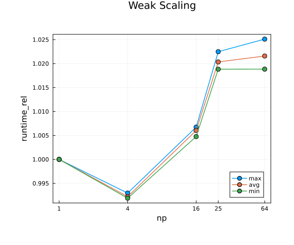

# StokesFlow.jl

[](https://github.com/dastrm/StokesFlow.jl/actions/workflows/CI.yml)

Multi-xPU solver for the 2D Stokes & continuity equations with variable density and viscosity written in Julia. Material properties are advected using marker-in-cell techniques.

## Introduction

The motion of viscous fluids can be modelled by solving the Navier–Stokes equations numerically. With a focus on the 2D Stokes equations with continuity assumption, a common simplification in computational fluid dynamics is explored in this project. For example, processes in the earth's mantle are commonly studied using similar assumptions, usually with more sophisticated coupling (e.g. temperature) which is not implemented here. Additionally, we demonstrate the use of packages in Julia which allow reasonable scaling from one CPU core to potentially thousands of GPU nodes with ease.

To avoid an unreasonably dense grid and still ensure no (purely numerical) diffusion of material properties, the marker-in-cell technique was chosen over implicit advection on the grid.

Also, every major function is tested by an extensive test suite.

## Content

- [StokesFlow.jl](#stokesflowjl)
  - [Introduction](#introduction)
  - [Content](#content)
  - [Script list](#script-list)
  - [Usage](#usage)
  - [2D Stokes and Continuity Equations](#2d-stokes-and-continuity-equations)
  - [Implementation](#implementation)
    - [General Structure](#general-structure)
    - [Details of Marker Methods](#details-of-marker-methods)
    - [Details of Stokes Solver](#details-of-stokes-solver)
  - [Results and Discussion](#results-and-discussion)
    - [Visualizations](#visualizations)
    - [Scaling](#scaling)
    - [Convergence](#convergence)
  - [Open Issues and Further Work](#open-issues-and-further-work)

## Script list

The [scripts](/scripts/) folder contains the following Julia scripts:
- [common.jl](scripts/common.jl), helper script with common functions
- [GlobalGather.jl](scripts/GlobalGather.jl), helper script for array collocation
- [MarkerExchange.jl](scripts/MarkerExchange.jl), helper script for marker exchange
- [MarkerToGrid.jl](scripts/MarkerToGrid.jl), helper script for marker to grid interpolation
- [MoveMarkers.jl](scripts/MoveMarkers.jl), helper script for marker propagation
- [StokesFlow2D_multixpu.jl](scripts/StokesFlow2D_multixpu.jl), main script
- [StokesSolver_multixpu.jl](scripts/StokesSolver_multixpu.jl), standalone multi-xPU Stokes solver
- [StokesSolver_scaling.jl](scripts/StokesSolver_scaling.jl), scaling analysis script
- [viz.jl](scripts/viz.jl), visualization script

## Usage

We provide a [Project.toml](Project.toml) file which installs all requirements upon activation. Once all packages are installed, the main script can be launched from the command line after uncommenting its last line as follows:

```sh
mpiexecjl -n 2 julia -O3 --check-bounds=no --project=. scripts/StokesFlow2D_multixpu.jl
```

Note that the `-n` flag controls the amount of MPI processes to be spawned, which in our exemplary case is set to two. During execution, relevant output is written to a newly created folder `viz_out`, including live visualization if desired. Additionally, if saving to file has been enabled, the visualization script can be run as follows:

```sh
julia --project=. scripts/viz.jl
```

In either case, the resulting figures can be found in the folder `viz_out`.

## 2D Stokes and Continuity Equations

The **2D Stokes and continuity** equations, assuming earth's gravity in positive $y$-direction, are:

$$
\frac{\partial \tau_{xx}}{\partial x} + \frac{\partial \tau_{xy}}{\partial y} - \frac{\partial P}{\partial x} = 0
$$

$$
\frac{\partial \tau_{yx}}{\partial x} + \frac{\partial \tau_{yy}}{\partial y} - \frac{\partial P}{\partial y} = -\rho g y
$$

$$
\nabla \cdot V = 0,
$$

with

$$
\tau_{xx} = 2 \mu \frac{\partial V_x}{\partial x} 
$$

$$
\tau_{yy} = 2 \mu \frac{\partial V_y}{\partial y} 
$$

$$
\tau_{xy} = \mu \left(\frac{\partial V_x}{\partial y} + \frac{\partial V_y}{\partial x}  \right).
$$

The material properties (carried by markers) are
* $\mu$ : viscosity
* $\rho$ : density,

the other variables (grid or constant) describe
* $V = [V_x, V_y]^T$ : velocity
* $P$ : pressure
* $g$ : gravity of earth
* $\tau$ : deviatoric stress tensor.

The **boundary conditions** implemented here are **free slip** on all four boundaries, i.e.

$$
V_x = 0, \ \ \frac{\partial V_y}{\partial x} = 0 \ \ \ \ \mathrm{on\ vertical\ boundaries}
$$

$$
V_y = 0, \ \ \frac{\partial V_x}{\partial y} = 0 \ \ \ \ \mathrm{on\ horizontal\ boundaries}
$$

The **initial conditions**, i.e. the initial density and viscosity distributions, must also be specified. The function `exampleCall()` in the [StokesSolver_multixpu.jl](scripts/StokesSolver_multixpu.jl) script, implements a toy model of a plume rising in the earth's mantle. However, the low density and viscosity of the top 'air' causes some instability ('drunken sailor instability'), which is explained in the section [Details of Stokes Solver](#details-of-stokes-solver).

## Implementation

### General Structure

After initialization, the computation loop's content is rather simple:

1. **Interpolate** marker properties (density and viscosity) to the computational grid
2. **Solve the Stokes & Continuity equations** on the grid using the interpolated material properties
3. Use the resulting velocity field to **advect the markers** using the explicit Runge-Kutta 4th order method
4. **Exchange markers** that have travelled outside their process region.

All the computation (the first three points) are implemented to fully run on either CPUs or GPUs.

The local domains, as well as overlaps and possible marker locations for each process are summarized in Fig. 1.

|                                           |
| :--------------------------------------------------------------------: |
| Fig. 1: Local domain and marker positions of the bottom right process. |

### Details of Marker Methods

The interpolation of marker properties to the grid is implemented in the `bilinearMarkerToGrid!(..)` method in [MarkerToGrid.jl](scripts/MarkerToGrid.jl). As the name suggests, the value on each grid point is determined by **bilinear** interpolation from all markers in the four cells adjacent to grid point:

$$
\mathrm{val}_{ij} = \frac{\displaystyle\sum_{m=1}^{M}{w_m\mathrm{val}_m}}{\displaystyle\sum_{m=1}^{M}{w_m}}
$$

$$
w_m = \frac{1-\mathrm{dxij}_m}{dx}\cdot \frac{1-\mathrm{dyij}_m}{dy},
$$

where
* $M$ is the amount of markers in the four adjacent grid cells,
* $dx$, $dy$ are the distances between grid points
* $\mathrm{dxij}_m$, $\mathrm{dyij}_m$ are the distances between marker $m$ and grid point ( $i$, $j$ )

|                |
| :-------------------------------------------------: |
| Fig. 2: Geometry of 'marker to grid' interpolation. |

Since this is a multi-process solver, special care must be taken near the domain boundaries. For example, the sums in both *numerator* and *denominator* need to be computed considering values from adjacent processes too.

For the **marker advection** with an explicit scheme, the velocities must be interpolated from grid points to arbitrary points in-between. This is also done bilinearly, with an additional correction. For any point $m$ inside a cell with nodes $n = 1,2,3,4$, the velocity is:

$$
V_m = \left(\sum_{n=1}^{4}{\frac{1-\mathrm{dxij}_n}{dx}\cdot \frac{1-\mathrm{dyij}_n}{dy}\cdot V_n}\right) + [\mathrm{corr}_x, \mathrm{corr}_y]^T,
$$

where
* $n$ loops over the four adjacent nodes
* $\mathrm{dxij}_n$, $\mathrm{dyij}_n$ are the distances between point $m$ and grid point $n$
* $\mathrm{corr}_x$, $\mathrm{corr}_y$ are chosen to match the so-called **continuity-based velocity interpolation** (for more information, see e.g. [here](https://presentations.copernicus.org/EGU21/EGU21-15308_presentation-h252958.pdf)). The benefit is that 'gaps' between markers are opening much slower. Essentially, this correction is a second order term coming from extending the 'stencil' by two nodes:
  * $V_x$ : depending on whether $m$ is located in the left or right half of the cell, consider additional left or right nodes
  * $V_y$ : depending on whether $m$ is located in the upper or lower half of the cell, consider additional upper or lower nodes

|                       |
| :--------------------------------------------------------: |
| Fig. 3: Geometry of 'grid to entire domain' interpolation. |

Since markers are allowed to move for up to half a cell per time step, this **continuity-based velocity interpolation** makes it necessary to extend the grid velocity arrays $V_x$ and $V_y$ by two nodes in $x$ and $y$ direction, respectively (cf. Fig. 1). Otherwise, the correction term could not easily be determined on the 'ghost' boundaries between processes.

### Details of Stokes Solver

The Stokes solver is implemented in the `solveStokes!(..)` method in [StokesSolver_multixpu.jl](scripts/StokesSolver_multixpu.jl). The basic structure and algorithm is similar to the [Stokes2D miniapp](https://github.com/omlins/ParallelStencil.jl/blob/main/miniapps/Stokes2D.jl) of [ParallelStencil.jl](https://github.com/omlins/ParallelStencil.jl), with some modifications:

* **free slip** boundary conditions
* Kernel fusing and some optimizations, where applicable
* Free surface stabilization, coupled with time step computation

This so-called **free surface stabilization** implicitly advects the density field $\rho$ to the next time step. This suppresses oscillations of the free surface, the so-called **drunken sailor instability**. Thus, especially the kernel computing the y-Stokes residual is significantly more involved, but enables much larger time steps. Fig. 4 and Fig. 5 demonstrate this effect.

|  |
| :-------------------------------------------------: |
|  Fig. 4: Markers with drunken sailor instability.   |

|  |
| :------------------------------------------------: |
|  Fig. 5: Markers with free surface stabilization.  |

## Results and Discussion

### Visualizations

Fig. 6 shows the evolution of grid values of the same problem as Fig. 5.
Parameters are as follows and identical to the function `exampleCall()` in [StokesFlow2D_multixpu.jl](scripts/StokesFlow2D_multixpu.jl):

```Julia
Nt = 20
Nx = 42
Ny = 42
Lx_glob = 10
Ly_glob = 10

μ_air, μ_matrix, μ_plume = 1e-2, 1e0, 1e-1  # Viscosity
ρ_air, ρ_matrix, ρ_plume = 1e-3, 3.3, 3.2   # Density
plume_x, plume_y = Lx_glob / 2, Ly_glob / 2 # plume midpoint
plume_r = min(Lx_glob, Ly_glob) / 5         # plume radius
air_height = 0.2 * Ly_glob                  # height of the 'sticky air' layer on top
```

|  |
| :---------------------------------------------: |
|        Fig. 6: Evolution of grid values.        |

### Scaling
Even on a small grid, the Stokes solver takes over `98%` of the entire computation time. For this reason, scaling analysis was only performed with the Stokes solver. The script [StokesSolver_scaling.jl](scripts/StokesSolver_scaling.jl) produces the following results.

First, **strong scaling** on a single GPU was measured. `T_eff` might seem rather small, however keep in mind that the solver needs to access many more arrays than the ideal lower bound. Also, Kernel fusing is not always possible due to dependencies, which increases memory accesses as well.

As expected, we can nicely observe rising effective throughput with increasing the grid size.

|  |
| :-----------------------------------------: |
|      Fig. 7: Strong scaling on 1 GPU.       |

Second, **weak scaling** measurements were also performed with up to 64 processes, with the best local grid size. We can see that the runtime is never increased by more than `2.5%`, which is really nice. The communication/computation overlap must work well! Interestingly, even a slightly reduced runtime can be observed with 4 ranks.

|                                            |
| :-------------------------------------------------------------------------------: |
| Fig. 8: Highest, lowest and mean relative runtime of all ranks, on up to 64 GPUs. |


### Convergence

An example of the Stokes solver's error evolution is plotted below. First, we can observe reasonable convergence, however after a certain amount of iterations, convergence rate decreases, which is suboptimal.
|                |
| :-------------------------------------------: |
| Fig. 9: Error evolution of the Stokes solver. |

## Open Issues and Further Work

* The Stokes solver converges rather slowly, likely caused by the big range of material properties which can span several orders of magnitude (e.g. density of *sticky air* vs. *mantle*). Some improvement can certainly be achieved with more parameter tuning, slightly smoothing the material property arrays, or even altogether implementing the iterations differently. However, one must pay special attention to avoid blowups of the solution, which is a delicate balance.

* For the specific parameter combination of **both** `USE_GPU=true` **and** `--check-bounds=yes`, the results of the Stokes solver are different, and thus the reference tests fail. This is very strange, especially since no bounds check ever fails.

* To model actually interesting phenomena, the physics could be extended in various ways. For example, coupling with the heat equation, different heating mechanisms and heat-dependent changes in material properties could be implemented.

* Advanced marker functionality, such as injecting markers where there are too few, is not implemented.
